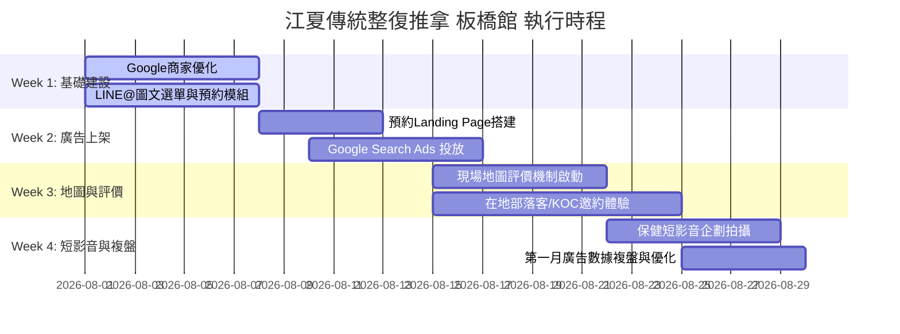

# 📅 04. 執行追蹤與進度清單｜江夏傳統整復推拿 板橋館

---

## 🗓️ 1. 四週落地執行時程表 (4-Week Action Plan)

---

## 📋 2. 詳細任務檢核清單 (Checklist)

### 🟢 Week 1: 基礎建設與門面優化（已完成 ✅）
- [x] **Google 商家檔案**：確認店名為 `江夏傳統整復推拿-板橋館《賴師傅》`，地址標示為 `館前西路152-1號`，補充照片與營業時間。
- [x] **LINE@ 官方帳號門面升級**：設定 v3 高級版 4 格圖文選單（線上立即預約、武術內勁鬆拿、到館交通導航、總公司 FB 粉絲專頁）。
- [x] **預約連結與 AI 客服對接**：按鈕直連 `我要預約` 觸發單點 AI 客服，並優化 `line_bot_prompt.md` 柔性退路邏輯。

### 🟡 Week 2: 廣告設定與正式投放
- [ ] **預約頁準備**：完成 1 頁式簡化預約 Landing Page（或設定 LINE@ 直連 URL）。
- [ ] **Google Ads 建立**：設定指定區域為「板橋區 3-5 公里」。
- [ ] **關鍵字與否定字**：輸入精準關鍵字組，並匯入 `健保, 骨科, 復健, 免費` 等否定關鍵字。
- [ ] **廣告文案審查**：確認無醫療違規用語（使用「舒緩肌肉」、「調整體態」）。

### 🔵 Week 3: 地圖評價與外部口碑
- [ ] **地圖好評**：目標本週增加 10+ 則詳細文字評價。
- [ ] **KOC 體驗合作**：聯繫並確認 3 位板橋在地部落客/IG 網紅到館時間。

### 🟣 Week 4: 內容行銷與數據複盤
- [ ] **短影音上架**：發布 2 支辦公室肩頸舒緩/姿勢衛教短影音。
- [ ] **廣告數據複盤**：檢查關鍵字點擊率 (CTR)、單次點擊成本 (CPC) 與預約轉換人數。

---

## 📊 3. 核心數據追蹤指標 (KPI Dashboard)

| 指標名稱 | 目標數值 | 當前數值 | 檢查週期 | 優化動作對策 |
| :--- | :--- | :--- | :--- | :--- |
| **Google Ads 點擊率 (CTR)** | > 5.0% | 待記錄 | 每週 | 若低於 3%，調整廣告標題與吸引訴求 |
| **平均單次點擊成本 (CPC)** | $12 - $25 TWD | 待記錄 | 每週 | 若過高，排除高價無效關鍵字 |
| **Google Maps 月搜尋曝光** | 提升 50% | 待記錄 | 每月 | 定期更新照片與發布商家動態 |
| **Google Maps 累積評價數** | > 50 則 (4.8★+) | 待記錄 | 每月 | 強化現場提醒與導流小禮物 |
| **LINE@ 預約月來店人數** | 成長 30%+ | 待記錄 | 每月 | 啟動舊客自動推播與滿意度關懷 |

---

## 🔗 相關筆記
- [[00_專案總覽]]
- [[01_品牌診斷與商圈分析]]
- [[02_Google關鍵字廣告實操指南]]
- [[03_全方位網路行銷藍圖]]
