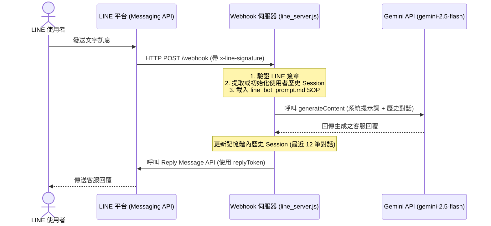

# 🤖 11. LINE@ AI 客服 (Gemini API) 接入與部署指南｜江夏傳統整復推拿 板橋館

本指南記錄了為「江夏傳統整復推拿 板橋館《賴師傅》」之 LINE@ 官方帳號接入 **Gemini API** 智慧客服的架構設計、程式碼實作、本地自動化啟動配置以及雲端部署方案。

---

## 🏗️ 1. 系統運作架構

本系統採用 Node.js Express 框架，作為 LINE Messaging API 的 Webhook 伺服器，並對接 Google Gemini API 實現多輪上下文記憶對話。



---

## ⚙️ 2. 環境變數配置 (.env)

專案根目錄下的 `.env` 檔案必須配置以下金鑰：

```env
# LINE Messaging API 設定
LINE_CHANNEL_SECRET=您的_LINE_CHANNEL_SECRET
LINE_CHANNEL_ACCESS_TOKEN=您的_LINE_CHANNEL_ACCESS_TOKEN_LONG_LIVED

# Gemini API 設定
GEMINI_API_KEY=您的_GEMINI_API_KEY
```
> ⚠️ **重要提醒**：`LINE_CHANNEL_ACCESS_TOKEN` 必須在 LINE Developers 後台點擊 **Issue** 取得超長字串（長度 > 100 字元），不可誤填為 User ID 或 Channel ID。

---

## 🛡️ 3. 台灣民俗調理法規紅線 (SOP 規範)

AI 客服的行為規則由 [line_bot_prompt.md](file:///c:/Users/love_/OneDrive/10_Antigravity_Workspace/meta/prompts/line_bot_prompt.md) 定義。為符合衛生局法規，AI 對答必須嚴格遵循以下界線：

*   **🚫 禁忌詞彙 (醫療效果，嚴禁使用)**：治療、療效、根治、骨盆矯正、關節復位、脊椎側彎矯正、正骨、消炎、止痛、扭傷拉傷發炎、復健、療程。
*   **✅ 替代詞彙 (保健舒緩，推薦使用)**：日常舒壓、紓解筋骨、消除疲勞、放鬆肌肉、身體平衡保養、調整體態。
*   **🛡️ 急性病症退路範本**：
    > 「您好！我們提供的是傳統整復與推拿服務，主要協助您進行**日常的紓解筋骨、放鬆肌肉與身體平衡保養**。
    > 如果您目前有**急性發炎、扭傷拉傷、或是骨關節受損等病症**，建議您先前往醫院進行專業診斷與治療。待急性症狀緩解、進入日常保養階段時，非常歡迎您來我們這裡進行筋骨放鬆與日常保健喔！💆‍♂️」

---

## 🖥️ 4. 本地自動化與開機自啟配置 (Windows)

為了讓伺服器在本地電腦開機後自動重啟運行，且不需要每次手動更新 LINE 的 Webhook 網址，我們採用 **LocalTunnel 固定子網域** 與 **Windows 啟動資料夾** 結合：

### 1. 本地啟動腳本 ([start_line_bot.bat](file:///c:/Users/love_/OneDrive/10_Antigravity_Workspace/meta/start_line_bot.bat))
在工作區中建立批次檔，啟動 Node 伺服器並使用 `--subdomain` 鎖定網域：
```cmd
@echo off
title 江夏傳統整復推拿 LINE 客服啟動器
echo 正在啟動 LINE 客服 AI Webhook 伺服器...
cd /d "c:\Users\love_\OneDrive\10_Antigravity_Workspace\meta"

:: 啟動 Node.js Webhook 伺服器 (埠口 3000)
start "江夏 LINE 伺服器" cmd /k "node line_server.js"
timeout /t 3 >nul

echo 正在啟動 LocalTunnel 穿透服務 (網址：https://jiangxia-massage-cs.loca.lt)...
start "江夏 LocalTunnel 隧道" cmd /k "npx localtunnel --port 3000 --subdomain jiangxia-massage-cs"

echo 啟動完成！後台兩個獨立視窗將會持續運行。
timeout /t 5
exit
```

### 2. 開機自啟動設定
該腳本已複製到 Windows 的啟動資料夾中：
`$env:APPDATA\Microsoft\Windows\Start Menu\Programs\Startup\start_line_bot.bat`
電腦開機後，將自動鎖定固定 Webhook 網址：
`https://jiangxia-massage-cs.loca.lt/webhook`

---

## ☁️ 5. 雲端部署優化指引 (生產環境)

若要實現 24 小時不關機且 100% 穩定的連線，可將專案部署至雲端主機：

1.  **伺服器進程守護 (PM2)**：
    ```bash
    npm install -g pm2
    pm2 start line_server.js --name "jiangxia-bot"
    pm2 startup
    pm2 save
    ```
2.  **HTTPS 反向代理配置 (Nginx / Caddy)**：
    - 使用 **Caddy**（自動處理 SSL 憑證）：
      ```caddyfile
      bot.yourdomain.com {
          reverse_proxy localhost:3000
      }
      ```
    - 在 LINE Developers 貼上永久網址：`https://bot.yourdomain.com/webhook`。

---

## 🔗 相關連結
- [[LINE_官方帳號門面與文案設定SOP]]
- [[04_執行追蹤與進度清單]]
- [[00_專案總覽]]
